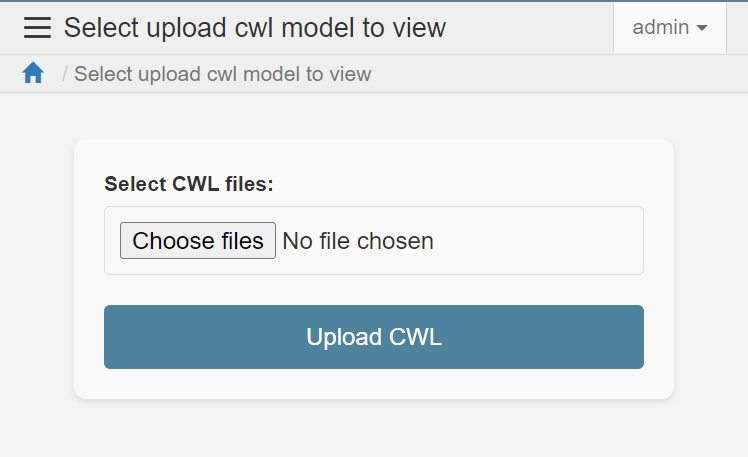
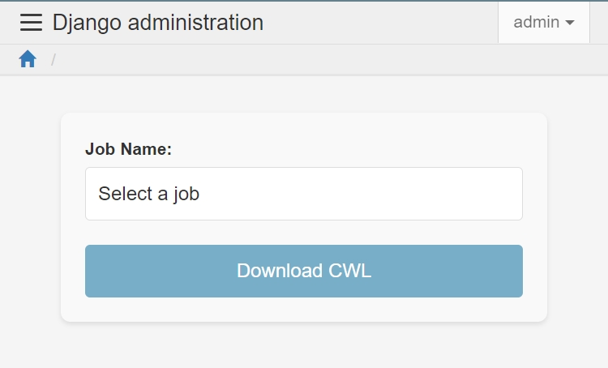
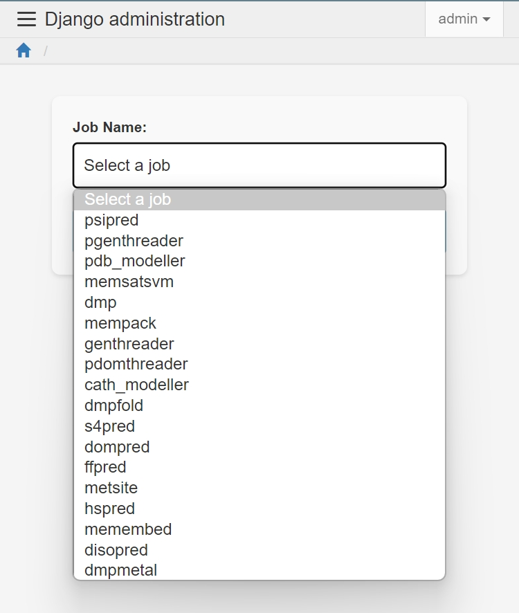

.. _CWL_upload_and_download:

CWL Upload and Download
=======================

CWL Upload Page
---------------

The CWL Upload Page allows users to upload multiple CWL files.
The system processes these files in the background and creates
new :ref:`tasks or jobs <the_Job_UI>` based on the CWL file types.

CWL Download Page
-----------------

The CWL Download Page enables users to select existing jobs
in the system and generate multiple executable CWL files.
